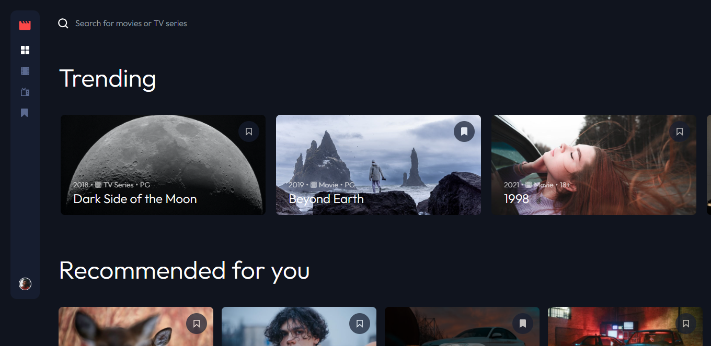
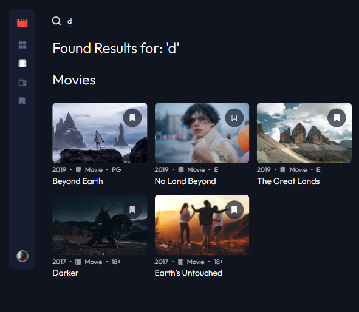
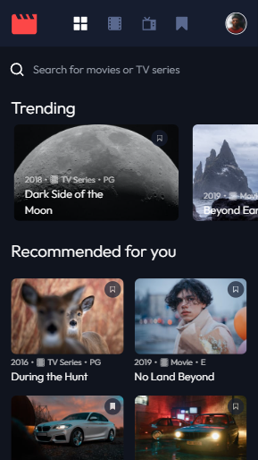

# Entertainment Web App

## Table of contents

- [Overview](#overview)
  - [The challenge](#the-challenge)
  - [Screenshot](#screenshot)
  - [Links](#links)
- [My process](#my-process)
  - [Built with](#built-with)
  - [What I learned](#what-i-learned)
  - [Continued development](#continued-development)
  - [Useful resources](#useful-resources)
- [Author](#author)
- [Acknowledgments](#acknowledgments)

## Overview

### The challenge

Users should be able to:

- View the optimal layout for the app depending on their device's screen size
- See hover states for all interactive elements on the page
- Navigate between Home, Movies, TV Series, and Bookmarked Shows pages
- Add/Remove bookmarks from all movies and TV series
- Search for relevant shows on all pages
- **Bonus**: Build this project as a full-stack application

### Screenshot





### Links

- Live Site URL: [Vercel](https://entertainment-app-xi.vercel.app/)

## My process

### Built with

- Flexbox
- CSS Grid
- Mobile-first workflow
- [React](https://reactjs.org/) - JS library
- [Next.js](https://nextjs.org/) - React framework
- [MongoDB](https://www.mongodb.com/) - Database
- [Node.js](https://nodejs.org/en/) -JS Runtime
- [Tailwind CSS](https://tailwindcss.com/) - CSS Framework
- [Framer Motion](https://www.framer.com/motion/) - Animation Styles

### What I learned

Data fetching in Next.js using getServerSideProps

```jsx
export async function getServerSideProps(context) {
  let response = await fetch(`${server}/api/media`);
  // extract the data
  let data = await response.json();

  return {
    props: {
      media: data["message"],
    },
  };
}
```

How to get information from a database.

```js
async function getMedia(req, res) {
  try {
    // connect to the database
    let { db } = await connectToDatabase();
    // fetch the media
    let media = await db.collection("media").find({}).toArray();
    // return the media
    return res.json({
      message: JSON.parse(JSON.stringify(media)),
      success: true,
    });
  } catch (error) {
    // return the error
    return res.json({
      message: new Error(error).message,
      success: false,
    });
  }
}
```

Updating values in Database

```js
async function updateMedia(req, res){
  try{
    //connect to database
    let {db} = await connectToDatabase();

    //update the bookmark status
    await db.collection('media').findOneAndUpdate(
            {
              _id: new ObjectId(req.body)
            },

            [
              { $set: { isBookmarked: { $not: "$isBookmarked" } } }
            ],

            {returnDocument:"after",
              returnOriginal: false},

    ).then(updatedDocument => {
      return res.json({
        message: "Bookmark State Changed!",
        success: true,
        doc: updatedDocument
      })
    })


```

### Continued development

Personally, this project was a good learning experience when it comes to backend development and interacting with a database. I want to grow my knowledge base in the Next.js framework.

### Useful resources

- [Learn How to Use Next.js Environment Variables and NEXT_PUBLIC](https://www.youtube.com/watch?v=nNShvLJgvcM&ab_channel=AdoKukic) - This video helped me wrap my mind around using environment variables in my Next.js code
- [The Next.js Documentation](https://nextjs.org/docs) - Very well written docs that made my introduction to Next.js a bit easier.
- [How to Integrate MongoDB Into Your Next.js App](https://www.mongodb.com/developer/how-to/nextjs-with-mongodb/) - I didn't use all of this, but it helped me understand the process of integrating a database in a web app. I will refer to this article frequently going forward

## Author

- Website - [Rodderick Garland](https://www.rodthedev.com/)

## Acknowledgments

Special thanks to [Tyrell Curry](https://github.com/tyrellcurry) for collaborating with me on this project.
